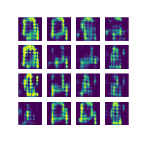

### Fashion mnist DCGAN
This repo contains an elegant implementation of DCGAN for generating fashion images using tensorflow and keras.



### requirements
- tensorflow >= 2.0
- pillow
- matplotlib

### How to train model
```
python3 dcgan.py
```
